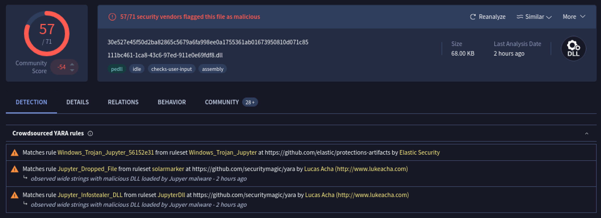
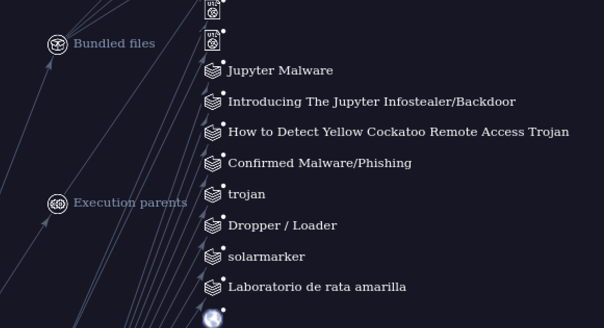
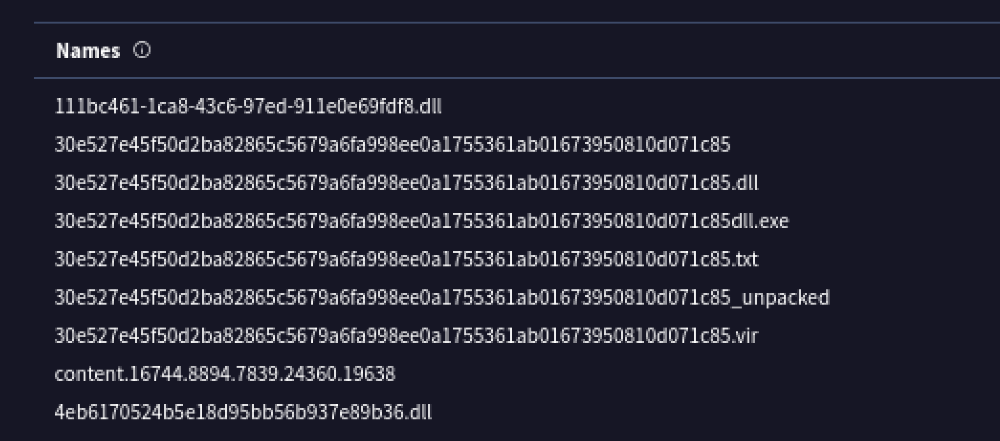
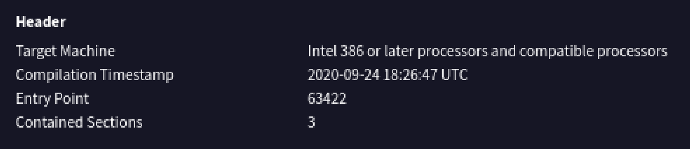
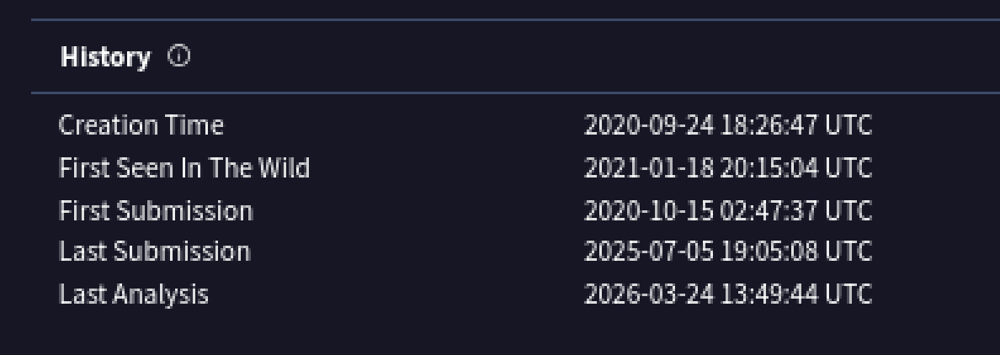
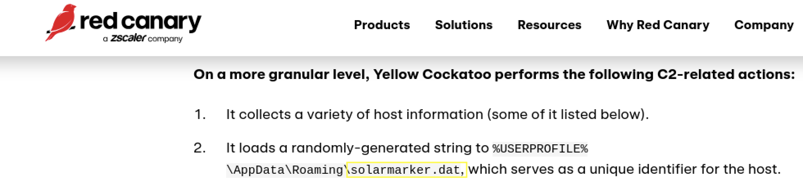

# Yellow RAT Malware Analysis Report

## Platform
CyberDefenders — Yellow RAT Lab  
Virtual Machine (Isolated Lab Environment)

## Scenario
During a routine IT security check at GlobalTech Industries, abnormal network traffic was detected originating from multiple workstations. Users reported that search queries were being redirected to unfamiliar websites. This suspicious behavior indicated a potential malware infection. The objective of this investigation was to analyze the suspicious file, identify the malware family, determine indicators of compromise, and uncover command-and-control infrastructure used by the threat.

## Tools Used
- VirusTotal  
- Red Canary Threat Intelligence Report  
- CyberDefenders Lab Environment  
- Virtual Machine (VM)  

---

## Malware Identification

The suspicious sample was analyzed using VirusTotal. The file was flagged as malicious by multiple security vendors.

Further investigation using the VirusTotal Relations graph identified the malware family as **Yellow Cockatoo RAT**.

---

## File Name Indicator

Analysis revealed the malware used the following filename:

111bc461-1ca8-43c6-97ed-911e0e69fdf8.dll

This filename can be used by defenders to scan endpoints for infection.

---

## Compilation Timestamp

The malware compilation timestamp was identified from the PE header metadata:

2020-09-24 18:26

This indicates the malware was compiled prior to its detection in the wild.

---

## First Submission to VirusTotal

The first submission timestamp provides insight into when the malware was first publicly observed:

2020-10-15 02:47

This suggests a delay between compilation and detection.

---

## Dropped File Artifact

Threat intelligence research revealed the malware drops a .dat file in the AppData directory:

solarmarker.dat

This file serves as a host identifier and persistence mechanism.

---

## Command and Control (C2)

The malware communicates with the following command and control server:

https://gogohid.com

Blocking this domain would prevent further communication with attacker infrastructure.

---

## Indicators of Compromise (IOCs)

Malware Family:  
Yellow Cockatoo RAT  

Filename:  
111bc461-1ca8-43c6-97ed-911e0e69fdf8.dll  

Dropped File:  
solarmarker.dat  

C2 Server:  
https://gogohid.com  

Compilation Timestamp:  
2020-09-24 18:26  

First Seen:  
2020-10-15 02:47  

---

## Conclusion

The investigation identified the malware as Yellow Cockatoo RAT. The sample exhibited behavior consistent with a remote access trojan, including host identification, dropped file persistence, and communication with a command-and-control server. Indicators extracted during analysis can be used for threat hunting and detection across enterprise environments.

## Skills Demonstrated

- Malware Analysis  
- Threat Intelligence Correlation  
- Indicator of Compromise Extraction  
- Timeline Analysis  
- Command and Control Identification  
- VirusTotal Analysis  